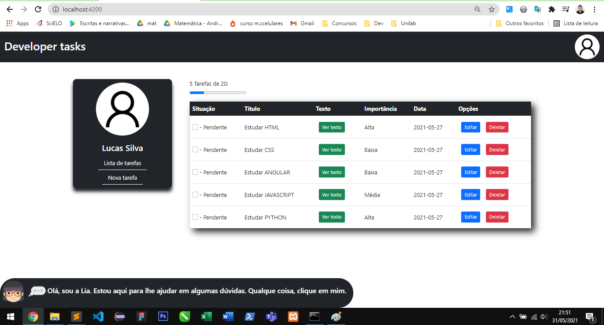
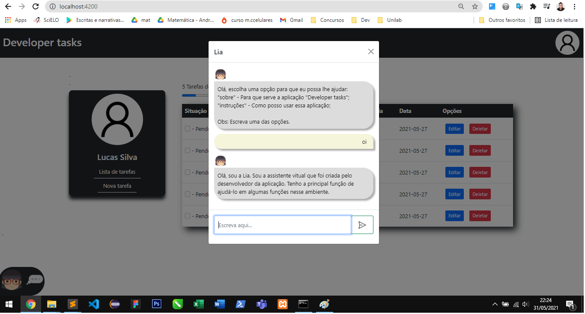

<h1 align="center">
  
</h1>

Desenvolvido no Angular 9, a aplicação Developer-tasks tem como principal função o cadastro de tarefas diárias. Ou seja, o usuario poderá cadastrar, editar e excluir uma tarefa. Além disso, a aplicação conta um uma simples assistente virtual desenvolvida em JavaScript que responde perguntas simples sobre a aplicação.

<h2 align="center">Desenvolvedor:</h2>

Lucas da Silva &logo=<LOGO>">

<h1>Sobre a Aplicação(DEV):</h1>

A aplicação foi desenvolvida no Angular 9. O sistema que armazena os dados da aplicação encontra-se nela mesma. Ou seja, não foi utilizado nenhum tipo de banco de dados externo à aplicação(MySQL, SQL Serve etc...). A assistente virtual foi desenvolvida com simples condicionais IF ELSE do JavaScript para responder as perguntas.

